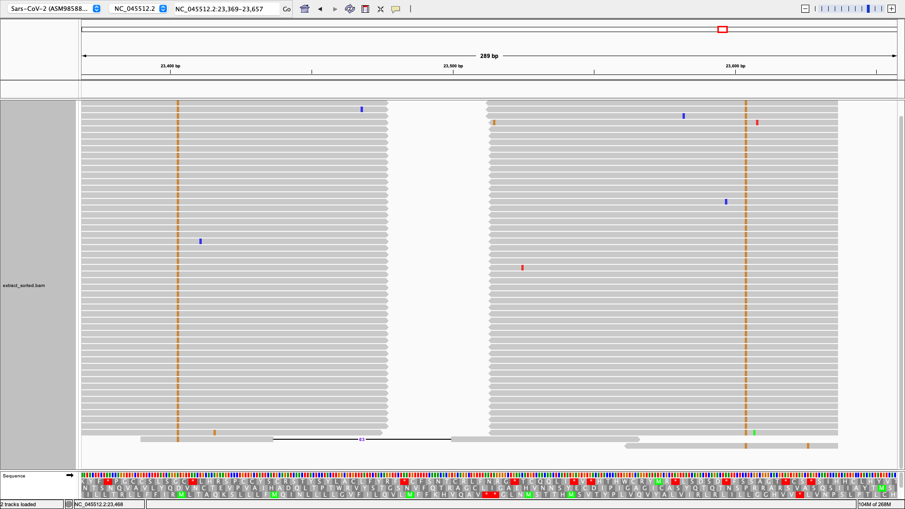

For this tutorial, we'll begin with the same aligned, trimmed, and sorted BAM file, [test.bam](https://github.com/andersen-lab/Freyja/raw/main/freyja/data/test.bam) used in the Command Line Workflow tutorial, along with the corresponding [SARS-Cov-2 reference genome](data/NC_045512_Hu-1.fasta). 


Let's start off by finding covariant mutations (i.e. mutations present on the same sequenced read) on the spike gene. We can do so using the command:


```bash
freyja covariants freyja/data/test.bam 21563 25384 --output covariants_output.tsv
``` 

This saves covariance information to covariants_output.tsv, including the mutations present, their absolute count and frequency, as well as the genomic ranges covered by reads containing said mutations. To get a better sense of the data, we can generate a heatmap plot via:

```bash
freyja plot-covariants covariants_output.tsv --output covariants_heatmap.png
```


As we can see, there appear to be a number of mutations that occur together in this sample, such as S:D614G and S:P681R. We can pull these reads from test.bam using `freyja extract`. First, we must specify the mutations by creating a csv file, and then listing the corresponding nucleotide mutations, which are listed in covariants_output.tsv.:
```
A23403G,C23604G
```
We can now run `freyja extract`, passing in our query.csv file alongside test.bam.  We'll include the --same_read flag since we're only interested in reads where both mutations are present

```bash
freyja extract query.csv freyja/data/test.bam --same_read --output extracted.bam
```

Finally, we can view the pulled reads via IGV. First, we'll need to sort and index `extracted.bam`:
```bash
samtools sort extracted.bam > extracted_sorted.bam
samtools index extracted_sorted.bam
```

Now load extracted_sorted.bam into IGV!


In some cases, it can be useful to remove reads containing one or more mutations. For instance, we might be interested in reads containing S:D614G but **not** S:P681R. We can do this by first calling `freyja extract` to select reads containing S:D614G, and then using `freyja filter` on the extraced output to filter out reads containing S:P681R.

1. Extract S:D614G reads:


```
extract_query.csv: 
A23403G
```
```bash
freyja extract extract_query.csv freyja/data/test.bam --output S_D614G_extracted.bam
samtools sort S_D614G_extracted.bam > S_D614G_extracted_sorted.bam
samtools index S_D614G_extracted_sorted.bam
```

2. Filter S:P681R reads from `S_D614G_extracted.bam`
```
filter_query.csv:
C23604G
```
```bash
freyja filter filter_query.csv freyja/data/test.bam --output S_D614G_filtered.bam
```

The resulting S_D614G_filtered.bam should only contain reads containing S:D614G (which in this case happen to be unpaired reads with no coverage at S:P681).